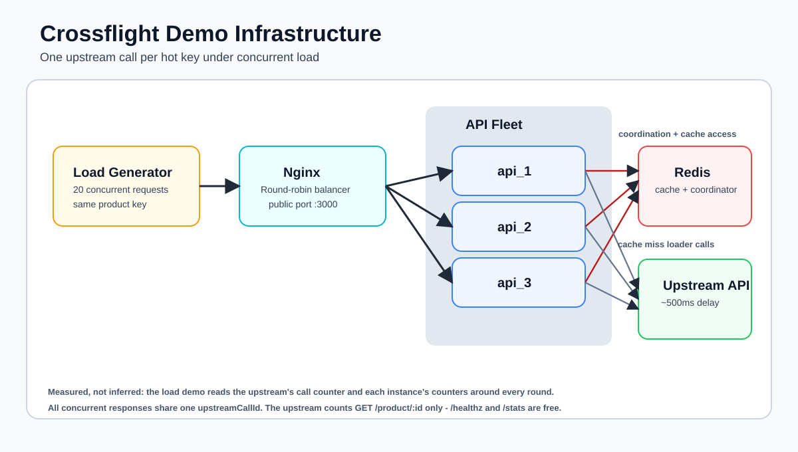

# Crossflight Demo

Demonstrates [Crossflight](https://github.com/gkoos/crossflight), a cross-process cache stampede protection library, with a realistic infrastructure.

## Infrastructure

| Service | Role |
| --- | --- |
| `upstream` | Slow product API - 500ms artificial delay per request |
| `redis` | Shared Redis - coordinator leases AND cache-manager backend |
| `api_1`, `api_2`, `api_3` | Express API servers using Crossflight to coalesce misses |
| `nginx` | Load balancer - round-robin across the three API instances on port 3000 |



## How it works

When 20 requests hit the same product key simultaneously, nginx distributes them across all three API instances. Without coordination each instance would call the upstream independently. Crossflight ensures only one instance acquires ownership and runs the loader — the others wait and read from cache once it's populated.

The cache is [cache-manager](https://github.com/node-cache-manager/node-cache-manager) with `cache-manager-ioredis-yet` as the Redis store. The coordinator uses a separate Redis connection with a different key namespace — the same Redis instance serves both concerns independently.

## Running

```sh
# Install project dependencies
npm install

# Build and start the full stack
npm run up

# In another terminal — fire 20 concurrent requests through nginx
CONCURRENCY=20 PRODUCT_ID=42 npm run load

# Follow logs
npm run logs

# Stop and clean up containers
npm run down
```

On Windows (PowerShell):

```powershell
$env:CONCURRENCY=20; $env:PRODUCT_ID=42; $env:API_URL="http://localhost:3000"; npm run load
```

## Example output

```
Crossflight load demo
  API:         http://localhost:3000
  Product ID:  200
  Concurrency: 20
  Rounds:      1

─── Round 1: 20 concurrent requests for product 200 ───

Results (575ms total):
  Requests sent:      20
  Successful:         20
  Upstream calls made: 1  ← should be 1 with Crossflight
  Upstream request #s: 4

  Responses by API instance:
    api:api_1  →  16 responses
    api:api_2  →  3 responses
    api:api_3  →  1 responses

  Sample product: {
  "id": "200",
  "name": "Product 200",
  "price": "1998.00",
  "fetchedAt": "2026-08-26T05:26:19.466Z",
  "upstreamRequest": 4
}
```

20 requests distributed across 3 processes. 1 upstream call. All 20 responses carry `upstreamRequest: 4` — proof they all got the same result from the single loader execution.

The api logs show the coordination in real time:

```
[api:api_1] CACHE MISS  key=product:200
[api:api_1] OWNER       key=product:200 — running loader
[api:api_2] CACHE MISS  key=product:200
[api:api_2] WAITING     key=product:200 — another instance is loading
[api:api_3] CACHE MISS  key=product:200
[api:api_3] WAITING     key=product:200 — another instance is loading
[api:api_1] COMPLETED   key=product:200 in 512ms
[api:api_2] CACHE HIT   key=product:200
[api:api_3] CACHE HIT   key=product:200
```

Run a second round immediately — the cache is warm and all 20 requests return as `CACHE HIT` with 0 upstream calls and sub-millisecond latency.

## Environment variables

### `api_1` / `api_2` / `api_3`

| Variable | Default | Description |
| --- | --- | --- |
| `REDIS_URL` | `redis://redis:6379` | Redis connection string |
| `UPSTREAM_URL` | `http://upstream:3001` | Upstream product API |
| `PORT` | `3000` | HTTP port (internal) |
| `TTL_MS` | `10000` | Cache TTL in ms |
| `INSTANCE_ID` | set per service | Identifier shown in logs |

### `upstream`

| Variable | Default | Description |
| --- | --- | --- |
| `PORT` | `3001` | HTTP port |
| `DELAY_MS` | `500` | Artificial response delay |

### `load` (CLI)

| Variable | Default | Description |
| --- | --- | --- |
| `API_URL` | `http://localhost:3000` | API base URL (nginx) |
| `PRODUCT_ID` | `42` | Product ID to request |
| `CONCURRENCY` | `20` | Concurrent requests per round |
| `ROUNDS` | `1` | Number of rounds to run |
